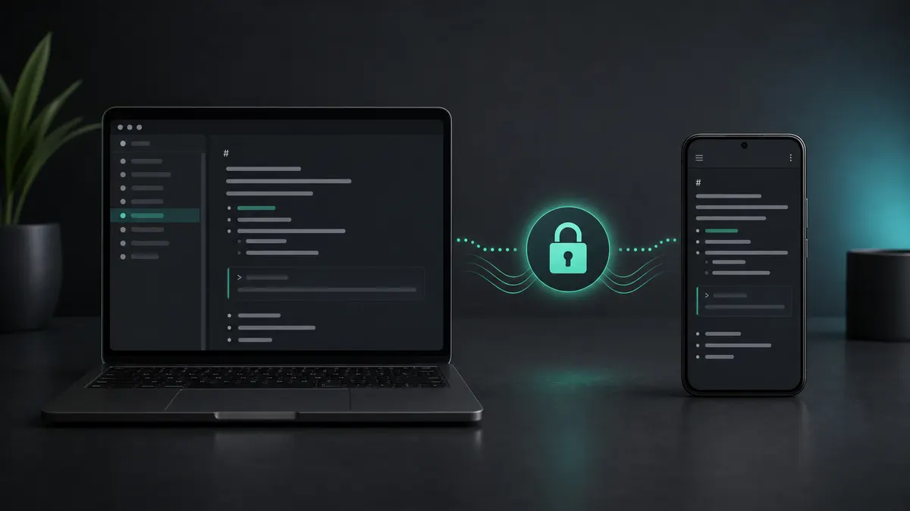
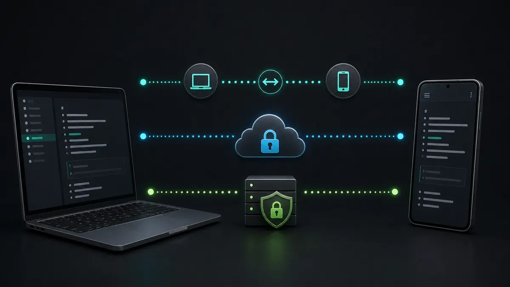
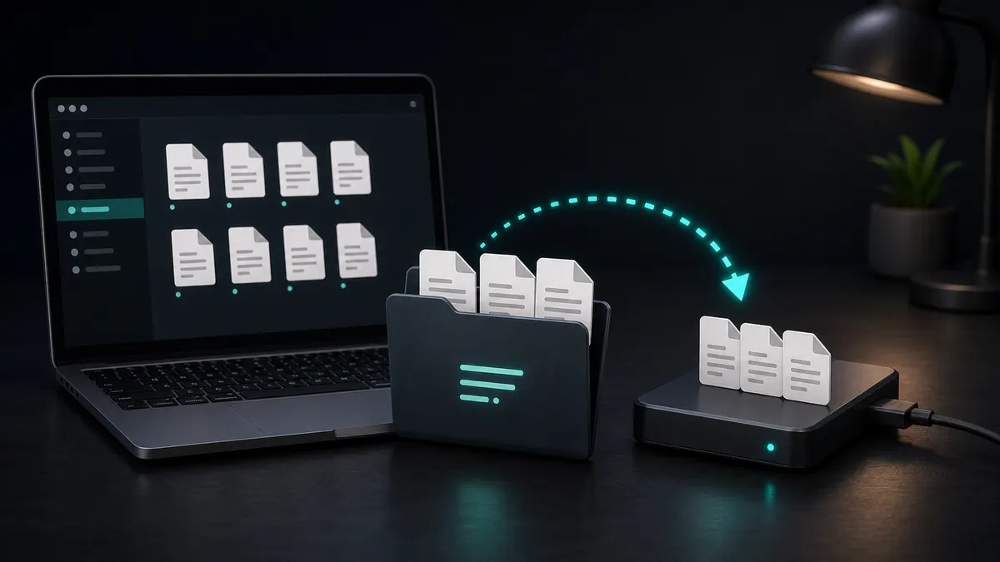

如果你想知道**如何在 Windows 和 Android 上同步 Obsidian**，简短答案是：想要最简单的官方方案，用 Obsidian Sync；想要免费的技术方案，用 Syncthing；想要私密、端到端加密的 Obsidian 同步替代方案，可以考虑 Synch。

Windows 和 Android 是一个很适合 Obsidian 的组合。两个平台都比 iOS 更容易直接访问本地文件夹，因此可选的同步方式更多。

但并不是每种方式都同样适合保护你的 vault。

Obsidian 会把笔记保存为本地 Markdown 文件。你的 vault 还可能包含附件、插件设置、主题、代码片段和 `.obsidian` 配置文件夹。同步工具需要移动这些文件，同时避免重复文件、冲突和损坏的设置。

本文只关注在 Windows PC 和 Android 手机之间同步 Obsidian。

## Windows 和 Android 的最佳选择

| 方式 | 最适合 | 成本 | 隐私 | 难度 |
| --- | --- | --- | --- | --- |
| Obsidian Sync | 想要官方设置的用户 | 付费 | 端到端加密 | 简单 |
| Synch | 想要免费或低成本私密托管同步的用户 | 免费和付费方案 | 端到端加密 | 简单 |
| Syncthing | 想要免费设备间同步的技术用户 | 免费 | 私密点对点同步 | 中等 |
| Google Drive、Dropbox、OneDrive | 桌面端为主的工作流 | 通常在存储限制内免费 | 取决于服务商 | 中等 |
| Git | 开发者和技术写作者 | 通常取决于托管服务 | 取决于远程主机 | 困难 |

对大多数 Windows 和 Android 用户来说，真正的选择通常是三个：

- 想要官方服务，选 **Obsidian Sync**
- 想要免费点对点同步并能处理设置，选 **Syncthing**
- 不想管理自己的同步系统，又想要私密加密同步，选 **Synch**

## 同步前：先备份 vault

在设置任何同步方式之前，先在 Windows 上复制一份 Obsidian vault。

vault 本质上就是一个文件夹。把它复制到同步文件夹之外的位置，例如外置硬盘或单独的备份目录。

这很重要，因为第一次同步是最容易出问题的时刻。如果工具指向了错误文件夹、把某台设备当作空白来源，或创建了冲突文件，备份能让你快速恢复。

同时决定是否同步 `.obsidian` 设置文件夹。同步它可以让插件、主题、快捷键和应用设置在设备间更接近，但桌面和移动端不一定适合同一套设置。

## 选项 1：用 Obsidian Sync 同步

[Obsidian Sync](https://obsidian.md/sync) 是官方的 Obsidian 多设备同步方式。

对于 Windows 和 Android，它的设置最简单：

1. 在 Windows 上安装 Obsidian。
2. 打开已有 vault 或创建新 vault。
3. 订阅 Obsidian Sync。
4. 创建或连接 remote vault。
5. 等待 Windows vault 上传完成。
6. 在 Android 上安装 Obsidian。
7. 登录并把 Android 应用连接到同一个 remote vault。
8. 在 Android 上大量编辑前，等待 vault 下载完成。

主要优势是 Obsidian Sync 集成在应用内。它支持端到端加密、版本历史和选择性同步，比通用文件同步工具更理解 Obsidian。

取舍是价格。如果你愿意为官方服务付费，这是最容易推荐的方案。

## 选项 2：用 Synch 同步

Synch 是面向 Obsidian 用户的开源端到端加密同步服务。

它适合想要私密托管同步，但不想依赖 Google Drive、Dropbox、OneDrive，也不想自己管理点对点同步系统的用户。

一般流程如下：

1. 在 Windows 上安装 Synch Obsidian 插件。
2. 将 vault 连接到 Synch。
3. 等待首次上传完成。
4. 在 Android 上安装 Obsidian。
5. 在 Android 上安装并启用 Synch 插件。
6. 连接到同一个 Synch vault。
7. 在两台设备上编辑前，等待首次下载完成。

Synch 关注 Windows 和 Android 设置中的三个关键点：

- **端到端加密**：vault 数据会在上传前于本地加密。
- **Obsidian 兼容性**：同步工作流围绕 Obsidian vault 构建，而不是把它当作普通文件夹。
- **易接受的价格**：小型 vault 可使用免费方案，更大的个人使用可选择低成本 Starter 方案。

当前 Synch 免费方案包含 1 个同步 vault、50 MB 存储、3 MB 最大文件大小和 1 天版本历史。Starter 方案包含 1 个 vault、1 GB 存储、5 MB 最大文件大小和 1 个月版本历史。

如果你想要比 Syncthing 更简单、比通用云盘更重视隐私的方案，Synch 很适合。

## 选项 3：用 Syncthing 同步

[Syncthing](https://syncthing.net/) 是 Windows 和 Android 上很受欢迎的免费方案。

它会在设备之间直接同步文件夹。你的笔记不需要存放在中心化云盘中，因此对想要私密点对点设置的用户很有吸引力。

典型设置如下：

1. 在 Windows 上安装 Syncthing。
2. 在 Android 上安装兼容 Syncthing 的应用。
3. 在 Windows 的 Syncthing 中添加 Android 设备。
4. 在 Android 的 Syncthing 中添加 Windows 设备。
5. 从 Windows 共享 Obsidian vault 文件夹。
6. 在 Android 上接受共享文件夹。
7. 在 Android 上把同步后的文件夹作为 Obsidian vault 打开。
8. 在两台设备上编辑笔记前，等待同步完成。

Syncthing 可以很好用，但你需要理解它的取舍。

两台设备需要有足够时间在线，才能交换变更。Android 后台行为也会因为电池设置影响同步时间。如果 Windows 和 Android 尚未同步就编辑同一篇笔记，仍然可能产生冲突。

如果你想要免费同步，并且不介意自己配置设备，Syncthing 是很好的选择。

## 选项 4：使用 Google Drive、Dropbox 或 OneDrive

云盘在 Windows 上可以轻松同步 Obsidian，但 Android 上的设置就没那么干净。

在 Windows 上，你可以把 vault 放进云盘同步文件夹。但在 Android 上，Obsidian 需要可靠的本地文件夹访问。许多云盘应用并不像始终可用的普通本地文件夹那样工作，所以你可能需要额外工具或手动下载流程。

如果你主要在 Windows 上编辑，只在 Android 上偶尔阅读，这种方式可以接受。如果你想要顺畅的双向编辑，它就不太理想。

另一个问题是隐私。除非你额外添加加密层，否则你的笔记会按云服务商的存储模型保护，而不是按 Obsidian 专用的端到端加密同步模型保护。

只有在 vault 很简单，并且你理解 Android 文件访问限制时，才建议使用云盘。

## 选项 5：使用 Git

Git 可以同步 Obsidian 笔记，因为 Markdown 文件很适合版本控制。

在 Windows 上，如果你已经使用开发工具，Git 很直接。在 Android 上，通常需要支持 Git 的应用或更手动的工作流。这让它很强大，但不适合日常无感笔记同步。

Git 适合：

- 明确的版本历史
- 查看变更
- 恢复旧版本笔记
- 开发者工作流

Git 不适合：

- 自动后台同步
- 快速移动端记录
- 非技术用户
- 避免合并冲突

如果你已经熟悉 Git，并且比起无缝同步更想要版本控制，可以使用 Git。

## 给大多数 Windows 和 Android 用户的建议

如果你想要最低摩擦和官方支持，选择 Obsidian Sync。

如果你想要免费设置，并且能管理设备配对、文件夹共享和 Android 电池设置，选择 Syncthing。

如果你想要带端到端加密的私密托管同步，并且希望流程比 Syncthing 更简单，选择 Synch。

不要在同一个 vault 上同时使用多个同步工具。例如，不要把同一个 vault 放在 OneDrive 里，同时又用 Syncthing 或另一个 Obsidian 同步服务同步。这是制造冲突的常见方式。

## 常见的 Windows 和 Android 同步问题

最常见的问题是在首次同步完成前就开始编辑。如果你连接了一台新的 Android 设备，请等整个 vault 下载完成后再修改。

另一个常见问题是 Android 电池优化。如果同步工具不允许在后台运行，变更可能不会在你预期的时间上传或下载。

大型附件也会拖慢同步。如果 vault 里有很多 PDF、图片、音频或视频，请先检查文件大小限制和选择性同步行为。

插件设置也需要小心。桌面插件设置不一定能完美适配 Android。如果移动端 Obsidian 行为异常，请检查你正在同步 `.obsidian` 的哪些部分。

## FAQ

### 在 Windows 和 Android 之间同步 Obsidian 的最佳方式是什么？

最简单的官方选项是 Obsidian Sync。最强的免费技术方案通常是 Syncthing。如果你想要带端到端加密的私密托管同步，Synch 就是为这个场景设计的。

### 可以免费在 Windows 和 Android 之间同步 Obsidian 吗？

可以。Syncthing 是 Windows 和 Android 上很强的免费选择。Synch 也为小型 vault 提供免费方案。云盘在存储限制内也可能免费，但 Android 文件夹访问会让它不那么方便。

### 可以用 Google Drive 在 Android 上同步 Obsidian 吗？

某些工作流可以做到，但它不是最干净的方案。Google Drive 更适合桌面同步，而不是在 Android 上作为 Obsidian 的无缝本地 vault 文件夹。

### Syncthing 对 Obsidian 安全吗？

如果你仔细配置、在另一台设备编辑前等待同步完成，并保留备份，Syncthing 可以安全使用。但它仍然是文件同步工具，所以你需要自己负责冲突处理和设备可用性。

### 应该同步 `.obsidian` 文件夹吗？

如果你想让 Windows 和 Android 上的插件、主题、快捷键和设置保持相似，可以同步。若你希望桌面和移动端使用不同设置，就不要盲目同步全部内容。

### Synch 是 Windows 和 Android 的 Obsidian Sync 替代方案吗？

是的。Synch 是私密、端到端加密的 Obsidian Sync 替代方案。如果你想要托管同步，但不想使用通用云盘或自己管理 Syncthing，它尤其适合。

## 最终建议

对于 Windows 和 Android，你比 iPhone 用户有更多不错的同步选择。

想要官方集成服务，使用 Obsidian Sync。想要免费点对点同步并能处理设置细节，使用 Syncthing。如果你是开发者并想要明确版本控制，可以使用 Git。

如果你想要一个适用于 Windows 和 Android 的私密、端到端加密 Obsidian 同步替代方案，同时不想把笔记工作流变成基础设施维护，选择 Synch。
