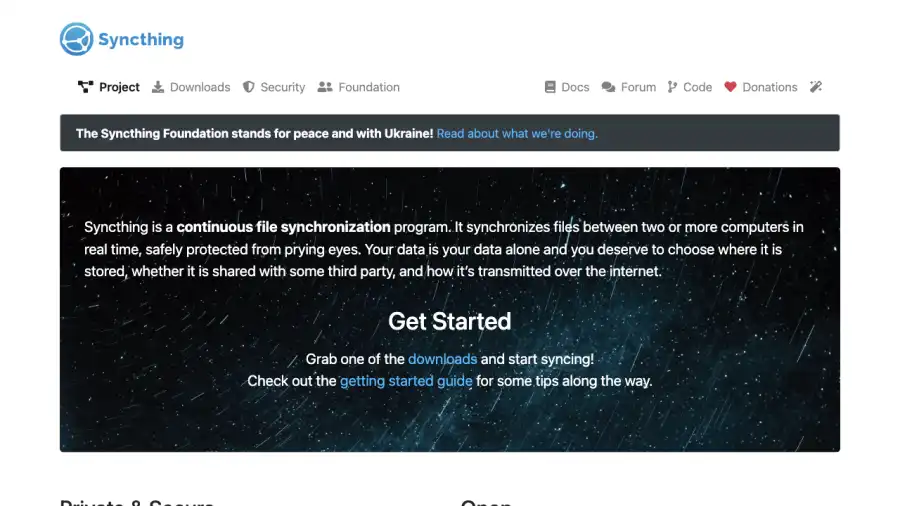
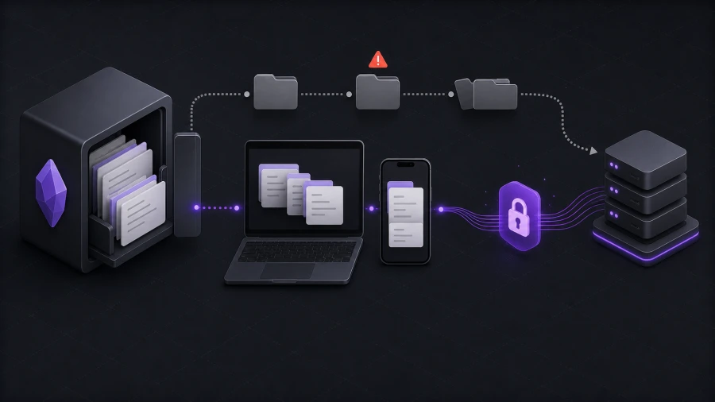

想免费、私密地同步 Obsidian 时，Syncthing 经常会被提到。

这很容易理解。[Syncthing](https://syncthing.net/) 是开源的，采用点对点同步模式，设计目标就是在设备之间同步文件。你不需要把笔记放进 Dropbox、Google Drive、iCloud 或 OneDrive，也不需要一个保存 vault 副本的中央存储服务器。

对技术用户来说，这正是它吸引人的地方。

但同步文件，和安全地同步一个 Obsidian vault，并不是同一件事。

Obsidian 是 local-first 应用，但 vault 不只是一个 Markdown 文件夹。它可能包含附件、插件数据库、主题、snippets、canvas 文件、workspace 状态，以及 `.obsidian` 配置文件夹。这些文件可能频繁变化，也可能从多台设备同时变化。

所以真正的问题不是：

> Syncthing 能同步 Obsidian 吗？

而是：

> Syncthing 的同步模型适合你的 Obsidian 使用方式吗？

## Syncthing 擅长什么

Syncthing 是一个持续文件同步工具。它通过文件系统监视和定期扫描检测文件变化，然后在两台或更多电脑之间同步这些变化。

它的优势很明确：

- 开源。
- 不把你的数据存到中央 Syncthing 服务器。
- 不依赖托管云存储来保存文件。
- 即使需要中继帮助连通，设备间通信也会使用 TLS 加密。
- 只有明确允许的设备才能连接。
- 可以同步许多不同类型的文件夹，不限于 Obsidian vault。

如果你想在桌面电脑和另一台常在线设备之间搭一个免费的 P2P 同步环境，Syncthing 可以是很强的选择。

尤其是当你已经理解文件同步、设备配对、文件夹共享和冲突恢复时，它会更适合你。

## 为什么 Obsidian vault 需要更小心

Obsidian vault 看起来很简单，因为笔记都是普通文件。这也是 Obsidian 最好的设计之一。

问题是，vault 里的活动并不总是简单。

一个普通 vault 可能包含：

- Markdown 笔记
- 图片、PDF、音频等附件
- Canvas 文件
- 插件设置
- 主题和 snippet 文件
- Workspace 状态
- 移动端专用设置
- `.obsidian` 里的隐藏文件

有些文件由你编辑，有些由 Obsidian 编辑，有些由插件编辑。有些文件甚至会在你没意识到自己改了什么时被重新写入。

这很重要，因为通用文件同步工具并不理解 Obsidian 的意图。它看到的是文件变化。它不知道这是插件设置变化，也不知道移动端 workspace 是否不该覆盖桌面布局，更不知道笔记冲突应该以怎样的人类可读方式恢复。

## 更适合 Syncthing 的 Obsidian 配置

使用方式越有纪律，Syncthing 越适合 Obsidian。

比较理想的配置通常是这样：

1. 有一个主要编辑用的桌面 vault。
2. 其他设备更多用于阅读或轻量记录。
3. 第一次同步前先做独立备份。
4. 先决定是否同步 `.obsidian`。
5. 在另一台设备编辑前，留足时间让同步完成。
6. 有检查和处理冲突文件的习惯。

如果你大多只在一台机器上编辑，另一台设备主要用来阅读或快速记录，Syncthing 可以很可靠。

如果你经常在多台设备上编辑同一批笔记，而且其中一些设备会离线，风险就会升高。

## Syncthing 搭配 Obsidian 的难点

Syncthing 很强，但责任在用户这边。

第一个难点是设备可用性。P2P 同步需要设备在线足够久，才能交换变化；这个连接可以是直接连接，也可以通过中继。如果你的笔记本正在睡眠，而手机上编辑了一篇笔记，那么在带有相关变化的设备重新能够通信之前，同步不会发生。

第二个难点是移动端行为。Android 的后台限制、电池优化和应用选择都会影响变化同步的速度。[官方 Syncthing Android 应用已在 2024 年 12 月 Syncthing 版本之后退休](https://forum.syncthing.net/t/discontinuing-syncthing-android/23002)，所以 Android 用户现在需要理解当前可用的路径，例如 Syncthing-Fork 或其他方案。

第三个难点是冲突处理。如果两台设备在同步完成前编辑了同一个文件，文件同步工具必须以某种方式保留两个版本。这比静默丢数据好，但清理工作仍然留给你。

第四个难点是 vault 配置。同步 `.obsidian` 可以让插件和设置保持一致，但也可能把桌面端假设复制到移动端。不同步 `.obsidian` 可以避免这一点，但设备之间的 Obsidian 行为可能会不一致。

这些问题并不说明 Syncthing 不好。它们说明 Syncthing 是文件同步工具，而 Obsidian vault 有应用层面的特殊行为。

## Syncthing vs Synch

Synch 采用的是另一种思路。

Syncthing 是通用的点对点文件同步工具。Synch 是专门为 Obsidian 构建的开源端到端加密同步服务。

这个差异会改变取舍。

| 问题 | Syncthing | Synch |
| --- | --- | --- |
| 同步什么？ | 文件夹和文件 | Obsidian vault 数据 |
| 是否开源？ | 是 | 是 |
| 是否端到端加密？ | 设备通信会加密，高级设置中可使用 untrusted-device 加密 | vault 数据在上传前本地加密 |
| 是否需要中央存储？ | 不需要 | hosted service 或 self-hosted Synch server |
| 是否理解 Obsidian？ | 否 | 是 |
| 是否需要设备配对和文件夹设置？ | 需要 | 不需要 P2P 设备配对 |
| 更适合谁？ | 想要设备间文件同步的技术用户 | 想要私密 Obsidian 同步、但不想管理文件同步基础设施的用户 |

如果你完全不想要托管存储，Syncthing 很有吸引力。

如果你想保留端到端加密和开源代码，同时获得更顺滑的 Obsidian 同步工作流，Synch 会更合适。

## 什么时候 Syncthing 是好选择

如果你想要 P2P 文件同步，并且愿意自己负责设置和维护，可以使用 Syncthing。

它适合这些情况：

- 你理解 Syncthing 如何在设备之间共享文件夹。
- 你愿意在编辑前检查同步状态。
- 你保留独立备份。
- 出现冲突文件时，你能自己处理。
- 你的设备会在可预期的时间上线。
- 你希望尽量避免托管存储。

对有桌面电脑、笔记本、家用服务器或 NAS 的技术用户来说，Syncthing 可以是干净、私密的配置。

## 什么时候 Synch 更合适

如果你不想把同步变成设备管理项目，Synch 会更适合。

Synch 面向重视隐私、但仍想要托管同步流程的用户。vault 数据会在上传前本地加密，所以服务器保存的是加密数据，而不是可读笔记。

Synch 更适合这些情况：

- 你想要围绕 Obsidian 设计的同步行为。
- 你不想管理 P2P 连接。
- 你想要带端到端加密的托管选项。
- 你想让移动端设置更简单。
- 你想在方案限制内使用版本历史和已删除文件恢复。
- 你想要免费或低成本的 Obsidian Sync 替代。

当前 Synch Free 方案包含 1 个同步 vault、50 MB 存储、3 MB 最大文件大小和 1 天版本历史。Starter 方案包含 1 个同步 vault、1 GB 存储、5 MB 最大文件大小和 1 个月版本历史。

这让 Synch 成为小型个人 vault、学生笔记、兴趣笔记，以及不想再增加高价订阅但仍想要私密加密同步的用户的实际选择。

## 如果你还是想用 Syncthing

选择 Syncthing 时，请谨慎设置。

第一次同步前，先完整备份 vault。不要把同步当成备份。同步工具也会非常高效地复制错误。

在另一台设备打开 vault 前，等待首次同步完成。许多本可避免的问题都发生在这一步。

先决定如何处理 `.obsidian`。如果你想让所有设备使用相同插件和设置，就有意识地同步它。如果你希望桌面端和移动端布局分开，可以考虑排除部分设置。

不要在同一个 vault 上叠加两个同步系统。不要把同一个 Obsidian 文件夹放在 iCloud 或 Dropbox 里，同时又用 Syncthing 或其他同步服务。叠加同步工具很容易造成重复文件和难以理解的冲突。

不要立刻删除冲突文件。它可能包含另一台设备离线时写下的唯一副本。

## FAQ

### Syncthing 能同步 Obsidian 吗？

可以。Obsidian vault 是本地文件夹，所以 Syncthing 能同步它。真正的问题是，你是否愿意自己管理文件同步、冲突、设备可用性和移动端行为。

### Syncthing 是端到端加密吗？

Syncthing 使用 TLS 保护已授权设备之间的通信，并且不会把文件存到中央 Syncthing 服务器。它也提供可选的 untrusted-device mode，用于在不完全信任的设备上保存加密数据。但这和托管 Obsidian 同步服务默认在上传前本地加密 vault 数据、再以加密形式存到远程服务器的模型不同。

### Syncthing 比 Obsidian Sync 更好吗？

取决于你看重什么。Syncthing 免费、开源、P2P。Obsidian Sync 是官方方案，集成在 Obsidian 中，并围绕 Obsidian 构建。Syncthing 给你更多控制权，但 Obsidian Sync 通常需要更少运维精力。

### Synch 是 Obsidian 的 Syncthing 替代吗？

如果你的目标是私密 Obsidian 同步，而不是通用文件夹同步，可以这么说。Syncthing 更宽泛，是 P2P 文件同步工具。Synch 更聚焦 Obsidian，提供端到端加密托管同步和自托管路径。

### 我应该用 Syncthing 还是 Synch？

如果你想要 P2P 文件同步，并且愿意管理细节，选择 Syncthing。如果你想要更容易设置、围绕 vault 行为设计的私密端到端加密 Obsidian Sync 替代，选择 Synch。

## 总结

Syncthing 是很强的文件同步工具。对合适的用户来说，它可以很好地同步 Obsidian vault。

但它仍然是文件同步。它不知道 Obsidian vault 意味着什么，不知道哪些文件是插件状态，不知道哪些冲突重要，也不知道笔记用户期待怎样的恢复流程。

如果你想要最大的 P2P 控制权，Syncthing 值得考虑。

如果你想要带端到端加密、设置负担更低的私密 Obsidian 同步，Synch 就是为这个场景构建的。
