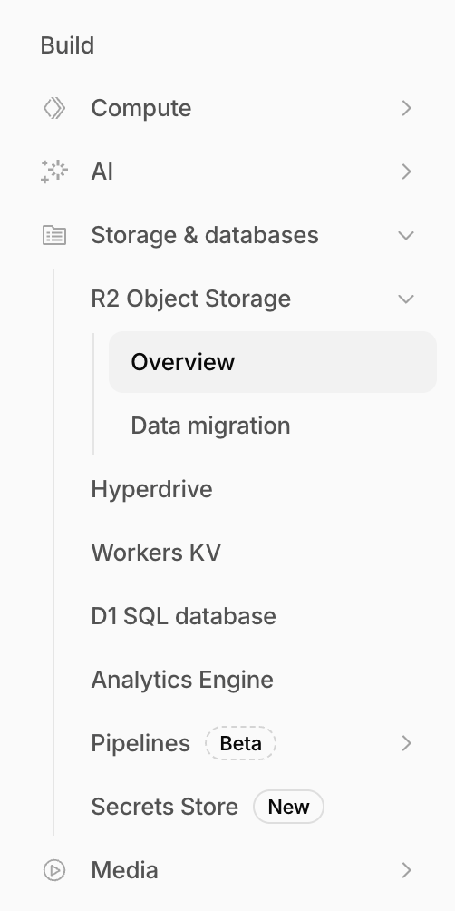
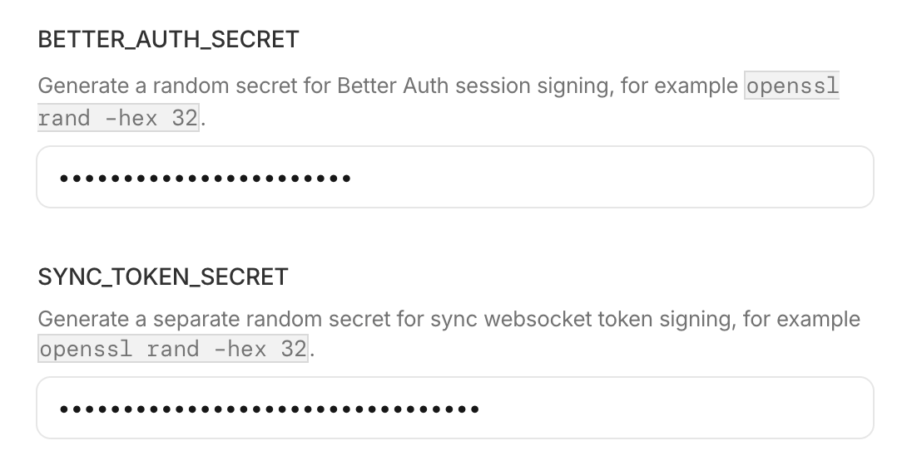
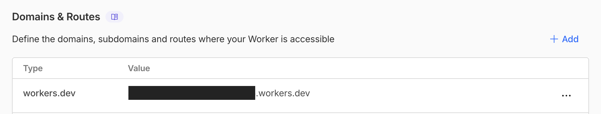

import SecretGenerator from "../../../components/SecretGenerator.astro";

이 가이드는 Cloudflare 무료 계정에 내 Synch 서버를 만들고, 그 주소를 Obsidian 플러그인에 넣는 과정을 안내합니다. 아래 버튼을 누르면 Cloudflare가 필요한 설정을 대부분 자동으로 준비합니다.

[](https://deploy.workers.cloudflare.com/?url=https://github.com/hjinco/synch/tree/main/apps/api)

## 배포 전에 확인할 것

Cloudflare 무료 계정으로 시작할 수 있습니다. 다만 Cloudflare 계정을 처음 만든 경우에는 먼저 R2를 활성화해야 합니다. Cloudflare 대시보드에서 **R2 Object Storage**로 이동한 뒤 결제 카드를 등록하고 R2를 켜 주세요. 이 과정을 건너뛰면 배포 중에 실패할 수 있습니다.



## API 배포하기

1. **Deploy to Cloudflare**를 클릭합니다.
2. Cloudflare에 로그인한 뒤 사용할 계정을 선택합니다.
3. 안내에 따라 GitHub 계정을 Cloudflare에 연결합니다.
4. secret을 입력하는 화면이 나오면 아래 두 값을 넣습니다.
   - `BETTER_AUTH_SECRET`
   - `SYNC_TOKEN_SECRET`

<SecretGenerator locale="ko" />

5. **Deploy** 버튼을 눌러 배포를 시작하고, 완료될 때까지 기다립니다.



## Obsidian에 연결하기

배포가 끝나면 Cloudflare Worker의 **Settings** 탭에서 Synch 서버 주소를 복사합니다. 주소는 보통 아래와 비슷한 형태입니다.

```text
https://your-synch-api.your-account.workers.dev
```



1. Obsidian을 엽니다.
2. **Settings**로 이동합니다.
3. **Synch** 설정을 엽니다.
4. **Self-hosted server**에 복사한 Synch 서버 주소를 붙여 넣습니다. 주소 끝에 `/`는 붙이지 않습니다.
5. **Save**를 클릭합니다.
6. 이후 로그인과 vault 설정은 평소처럼 진행합니다.
